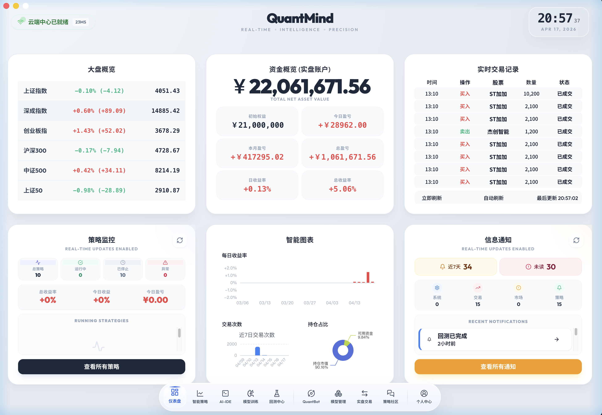
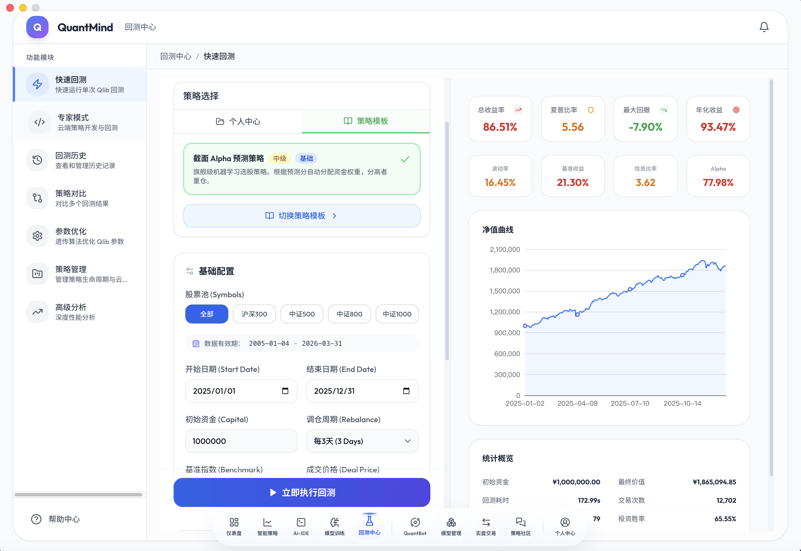
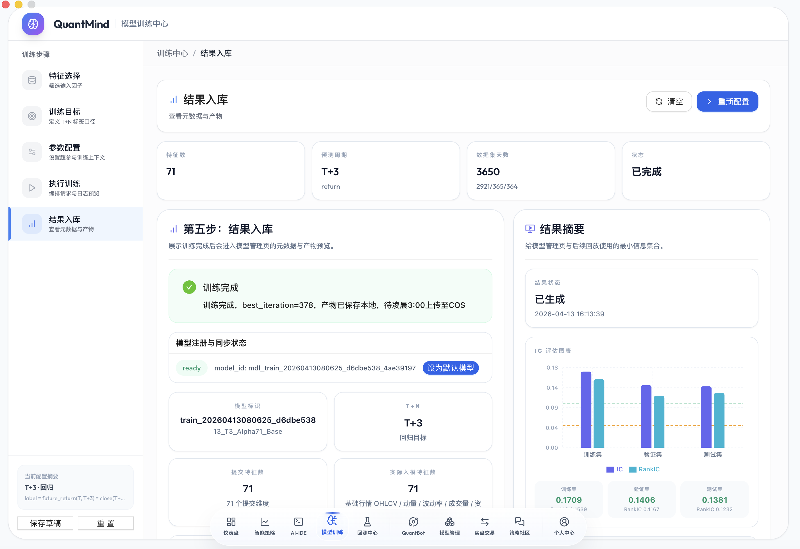
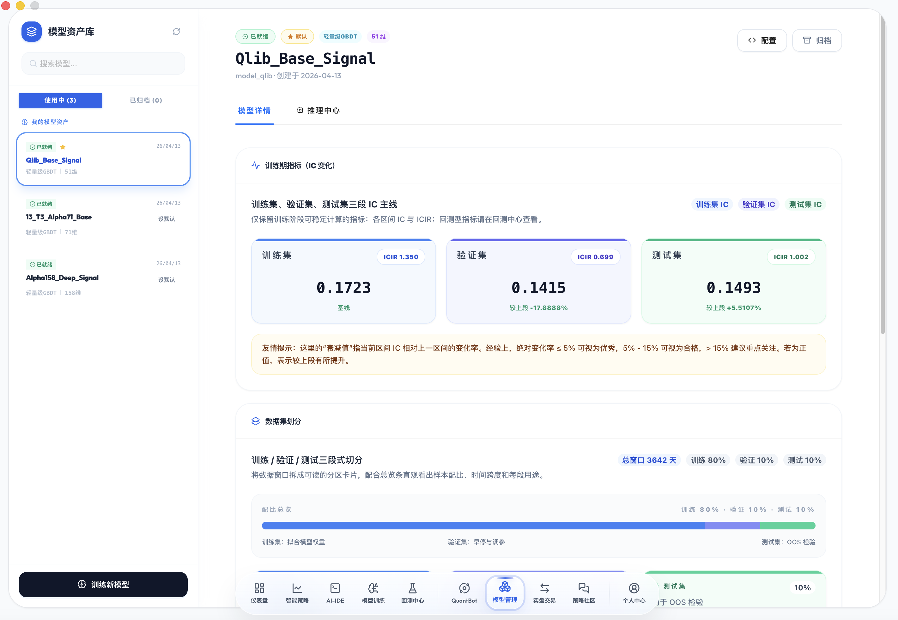
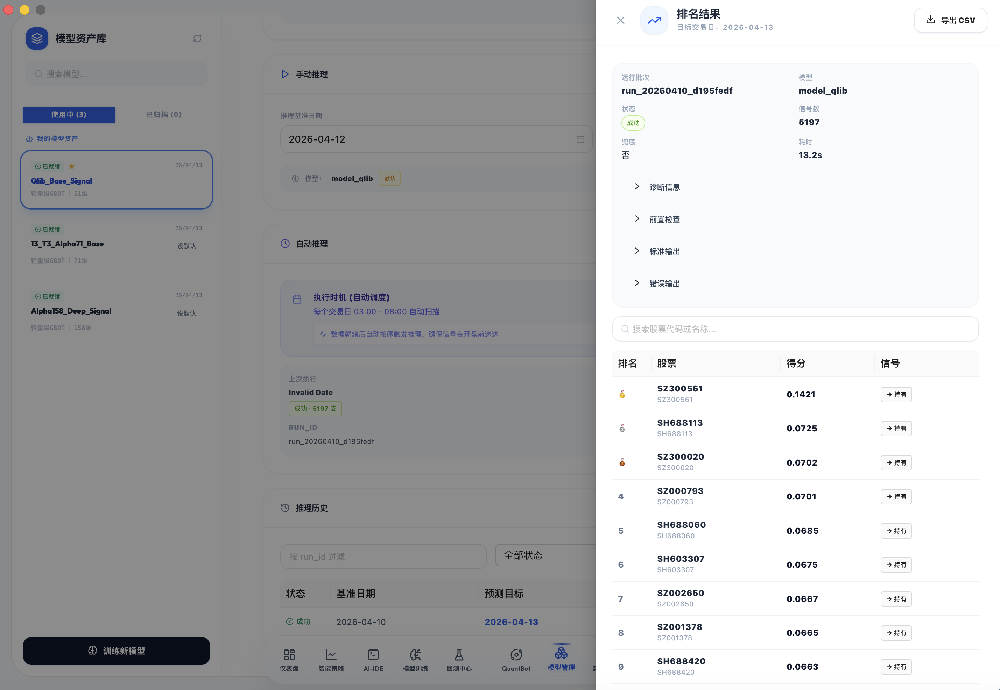
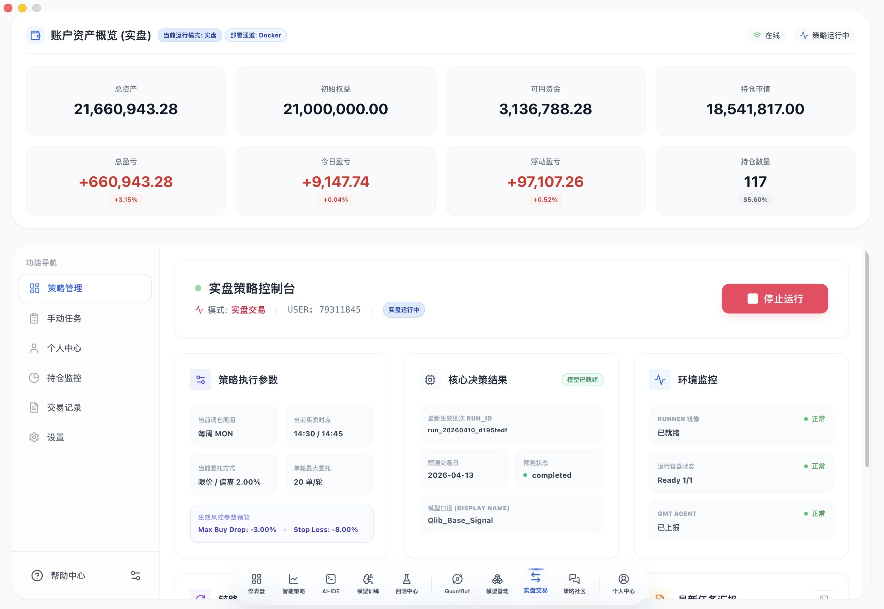
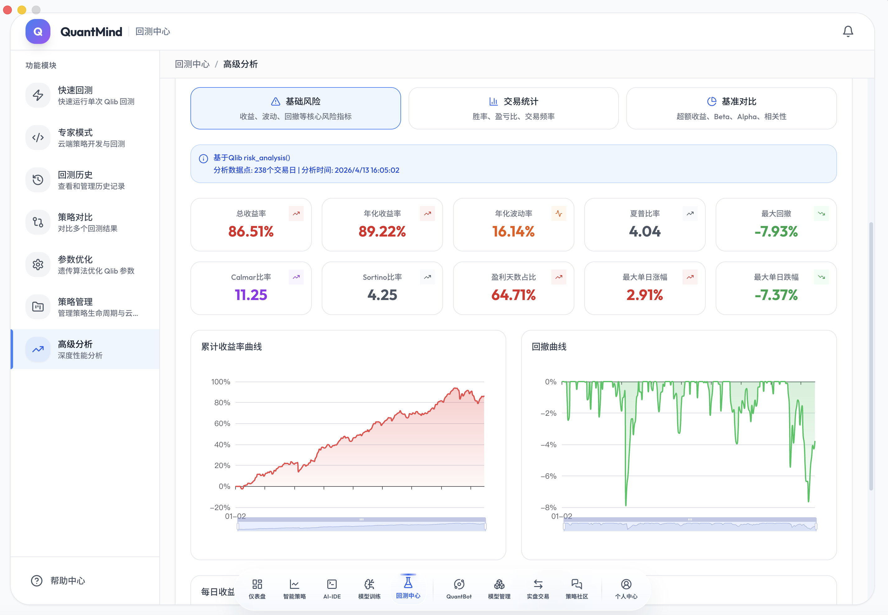
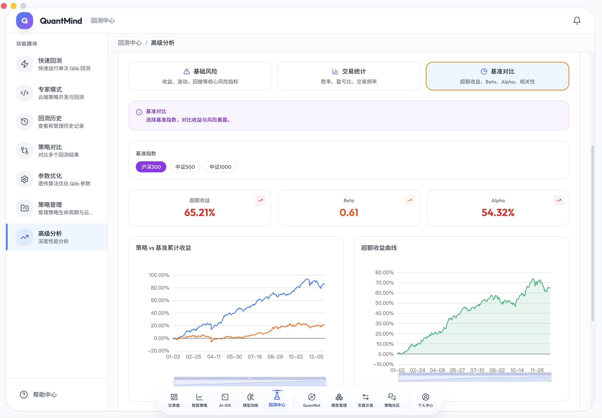

<p align="center">
  
</p>

<h1 align="center">QuantMind</h1>

<p align="center">
  <strong>新一代智能量化交易平台</strong>
</p>

<p align="center">
  <a href="#-核心特性">核心特性</a> •
  <a href="#-快速开始">快速开始</a> •
  <a href="#-功能演示">功能演示</a> •
  <a href="#-技术架构">技术架构</a> •
  <a href="#-部署指南">部署指南</a>
</p>

<p align="center">
  
  
  
  
</p>

---

## ✨ 核心特性

### 🧠 Qlib 内核驱动

基于微软 **Qlib** 量化框架深度集成，提供业界领先的量化研究能力：

- **LightGBM 模型** — 高性能梯度提升模型，专为金融时序预测优化
- **Alpha158 因子集** — 158 个经典量化因子，覆盖动量、估值、质量等多维度
- **自动化特征工程** — 48 维标准化特征，开箱即用

### 🎯 双引擎回测系统

独创 **Qlib + Pandas** 双引擎架构，灵活应对不同场景：

| 引擎 | 适用场景 | 性能 |
|------|----------|------|
| **Qlib Engine** | 复杂策略、多因子模型、机构级研究 | 极高性能 |
| **Pandas Engine** | 快速验证、简单策略、教学演示 | 轻量极快 |

### 🤖 AI 模型全生命周期管理

从训练到推理，完整闭环：

```
数据准备 → 模型训练 → 效果评估 → 模型部署 → 实时推理 → 信号生成
```

- **一键训练** — 自动化特征提取、样本划分、超参优化
- **模型版本管理** — 多模型共存，一键切换
- **实时推理** — 每日自动生成交易信号

### 📈 实盘交易对接

支持多券商实盘交易：

- **QMT 券商** — 迅投 QMT 深度对接
- **模拟盘验证** — 实盘前完整模拟
- **风控系统** — 止损止盈、仓位控制、风险预警

---

## 🚀 快速开始

### 环境要求

| 组件 | 版本 | 说明 |
|------|------|------|
| Docker | 20.10+ | 容器运行环境 |
| Docker Compose | 2.0+ | 服务编排 |
| Node.js | 18+ | 前端开发（可选） |
| 内存 | 8GB+ | 推荐 16GB |

### 一键部署

```bash
# 克隆项目
git clone https://github.com/anthropics/quantmind.git
cd quantmind

# 一键部署（Ubuntu 22.04+）
sudo ./deploy/deploy.sh
```

部署完成后访问：`http://<服务器IP>`

**默认账号：** `admin` / `admin123`

### 手动部署

```bash
# 启动后端服务
docker-compose up -d

# 查看服务状态
docker-compose ps

# 启动前端（开发模式）
npm install && npm run dev
```

---

## 📸 功能演示

### 📊 智能仪表盘

<p align="center">
  
</p>

实时监控账户状态、持仓盈亏、策略表现，一目了然。

### 🔬 快速回测

<p align="center">
  
</p>

分钟级完成策略回测，支持自定义参数、多标的组合、详细绩效报告。

### 🧠 模型训练

<p align="center">
  
</p>

可视化配置训练参数，自动完成特征工程、样本划分、模型训练与评估。

### 🎯 模型管理

<p align="center">
  
</p>

多版本模型管理，一键切换生产模型，查看训练日志与性能指标。

### 📈 模型推理

<p align="center">
  
</p>

每日自动推理生成交易信号，支持手动触发、信号导出、历史回溯。

### 💹 实盘交易

<p align="center">
  
</p>

对接券商实盘，支持自动下单、持仓同步、风险控制。

### 🛡️ 风险管理

<p align="center">
  
</p>

完善的风控体系：止损止盈、仓位限制、黑名单管理、异常预警。

### 📊 高级分析

<p align="center">
  
</p>

深度策略分析：收益归因、风险分解、因子暴露、Benchmark 对比。

---

## 🏗️ 技术架构

### 微服务架构

```
┌─────────────────────────────────────────────────────────────────┐
│                      QuantMind Platform                          │
├─────────────────────────────────────────────────────────────────┤
│                                                                   │
│  ┌─────────────┐  ┌─────────────┐  ┌─────────────┐  ┌─────────┐ │
│  │  API Gateway │  │   Engine    │  │    Trade    │  │ Stream  │ │
│  │   Port 8000  │  │  Port 8001  │  │  Port 8002  │  │Port 8003│ │
│  │              │  │             │  │             │  │         │ │
│  │ • 用户认证   │  │ • Qlib回测  │  │ • 订单管理  │  │• 实时行情│ │
│  │ • 策略管理   │  │ • 模型训练  │  │ • 持仓管理  │  │• WS推送 │ │
│  │ • 社区功能   │  │ • AI推理    │  │ • 风控系统  │  │• 数据订阅│ │
│  └─────────────┘  └─────────────┘  └─────────────┘  └─────────┘ │
│                                                                   │
└─────────────────────────────────────────────────────────────────┘
                              │
              ┌───────────────┼───────────────┐
              ▼               ▼               ▼
        ┌──────────┐    ┌──────────┐    ┌──────────┐
        │PostgreSQL│    │  Redis   │    │ 本地存储  │
        │   数据库  │    │  缓存    │    │  /data   │
        └──────────┘    └──────────┘    └──────────┘
```

### 技术栈

| 层级 | 技术选型 |
|------|----------|
| **前端** | Electron + React + TypeScript + Ant Design |
| **后端** | Python 3.10 + FastAPI + SQLAlchemy |
| **回测引擎** | Qlib + Pandas 双引擎 |
| **AI 模型** | LightGBM + Qlib Model Framework |
| **数据库** | PostgreSQL 15 + Redis 7 |
| **消息队列** | Celery + Redis |
| **容器化** | Docker + Docker Compose |

---

## 📖 部署指南

### 开发环境

```bash
# 后端开发
source .venv/bin/activate
pip install -r requirements.txt
python backend/main_oss.py

# 前端开发
npm install
npm run dev
```

### 生产部署

```bash
# 完整部署
sudo ./deploy/deploy.sh

# 仅后端
sudo ./deploy/deploy.sh --backend-only

# 仅前端
sudo ./deploy/deploy.sh --frontend-only

# 断点续传
sudo ./deploy/deploy.sh --resume
```

### 数据目录

| 目录 | 用途 | 说明 |
|------|------|------|
| `db/qlib_data/` | Qlib 回测数据 | 交易日历、标的列表、特征数据 |
| `db/feature_snapshots/` | 模型训练数据 | Parquet 格式特征快照 |
| `models/` | AI 模型文件 | 训练好的模型权重 |
| `data/postgres/` | PostgreSQL 数据 | 持久化存储 |
| `data/redis/` | Redis 数据 | 缓存与会话 |

---

## 🧪 测试

```bash
# 单元测试
python backend/run_tests.py unit

# 集成测试
python backend/run_tests.py integration

# 全量测试
python backend/run_tests.py all
```

---

## 📁 项目结构

```
quantmind/
├── backend/
│   ├── main_oss.py              # 统一入口
│   ├── services/
│   │   ├── api/                 # API 服务
│   │   ├── engine/              # 回测引擎
│   │   ├── trade/               # 交易服务
│   │   └── stream/              # 行情服务
│   └── shared/                  # 共享模块
├── electron/
│   └── src/                     # 前端源码
├── models/                      # 模型文件
├── db/                          # 数据文件
├── deploy/
│   └── deploy.sh                # 一键部署脚本
├── docker/
│   └── Dockerfile.oss           # 镜像构建
├── docs/                        # 文档
└── docker-compose.yml           # 服务编排
```

---

## 🤝 贡献

欢迎提交 Issue 和 Pull Request！

---

## 📄 License

[MIT License](LICENSE)

---

## 🙏 致谢

- [Qlib](https://github.com/microsoft/qlib) — 微软量化投资平台
- [LightGBM](https://github.com/microsoft/LightGBM) — 微软梯度提升框架
- [FastAPI](https://fastapi.tiangolo.com/) — 现代高性能 Web 框架

---

<p align="center">
  <strong>QuantMind</strong> — 让量化交易更简单
</p>
