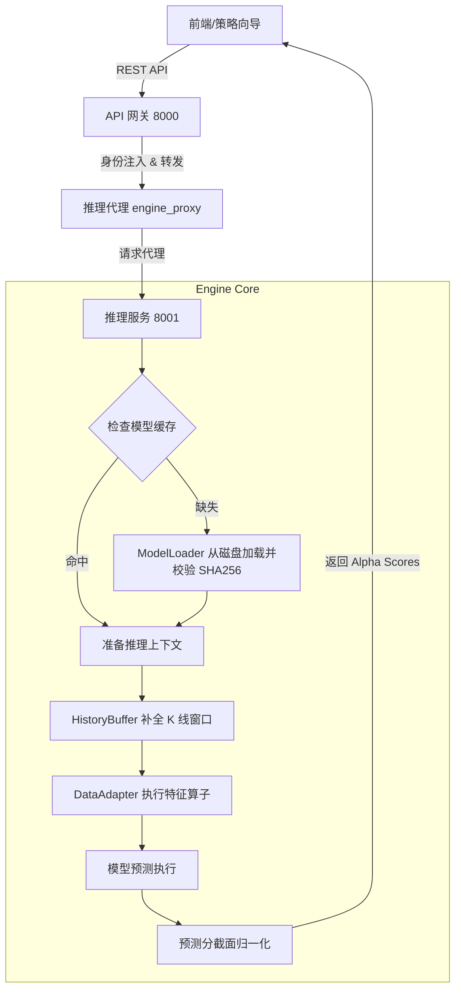

# 模型推理服务 (Inference Service) 设计与链路文档

## 1. 服务概述
QuantMind 模型推理服务是计算引擎 (`quantmind-engine`) 的核心模块，负责将训练好的量化模型应用于实时行情数据，生成预测信号（Alpha Scores）。该服务采用 **“共享模型内核 + 私有数据上下文”** 的架构，旨在平衡高性能计算与多租户隔离需求。

## 2. 核心架构设计

推理服务由四个关键层级组成：

| 组件名称 | 职责说明 | 关键特性 |
| :--- | :--- | :--- |
| **InferenceService** | 服务入口与编排 | 统一 API 接口，协调数据获取与模型调用。 |
| **ModelLoader** | 模型生命周期管理 | 支持 LRU 缓存、**SHA256 签名校验**、版本化管理。 |
| **DataAdapter** | 特征工程适配 | 动态计算技术指标（MA, RSI 等），确保离在线一致性。 |
| **HistoryBuffer** | 状态数据缓冲 | 维护滑窗 K 线数据（如最近 30 日），减少数据库 I/O。 |

## 3. 推理执行链路 (Workflow)

### 3.1 总体流程图


### 3.2 详细链路说明
1.  **身份校验与转发**：API 网关接收请求，从 JWT 提取 `user_id` 和 `tenant_id`，注入请求头并转发至 8001 端口。
2.  **模型安全加载**：`ModelLoader` 检查 `models/production/` 目录。在反序列化 `.pkl` 文件前，计算其 SHA256 摘要并与 `metadata.json` 对比，防止恶意代码注入（RCE 攻击）。
3.  **动态特征化**：`DataAdapter` 调用 Qlib 数据处理器。如果模型需要 `$close/Ref($close, 1)`，它会自动从 `HistoryBuffer` 获取所需长度的序列进行计算。
4.  **隔离推理**：虽然模型文件共享，但推理时的输入数据（股票池）是基于当前用户请求的。
5.  **结果输出**：输出值通常为 -1 到 1 之间的 Alpha 分数，直接对接仓位管理模块（Wizard Step 3）。

## 4. 模型存储规范
生产模型统一存储在 `models/production/`，结构如下：
```text
models/production/
└── model_qlib/
    ├── model.pkl            # 序列化模型权重
    ├── metadata.json        # 元数据（含 SHA256 签名、特征列表）
    └── workflow_config.yaml  # Qlib 运行流配置
```

## 5. 多租户隔离逻辑
*   **计算隔离**：通过 `ENGINE_PROXY_TIMEOUT_SECONDS` 限制单次推理时长，防止大批量任务阻塞。
*   **资源限制**：在 Docker 层限制计算引擎的内存（如 4GB），避免单个租户的复杂模型推理导致系统 OOM。
*   **数据权限**：`X-User-Id` 决定了推理时可访问的私有股票池和模拟盘上下文。

## 6. API 使用示例
**请求路径**: `POST /api/v1/inference/predict`
**Payload**:
```json
{
  "model_id": "model_qlib",
  "symbols": ["600036.SH", "600519.SH"],
  "params": {
    "normalization": "z-score"
  }
}
```

---
*文档更新日期：2026-02-22*
*QuantMind 研发团队*
